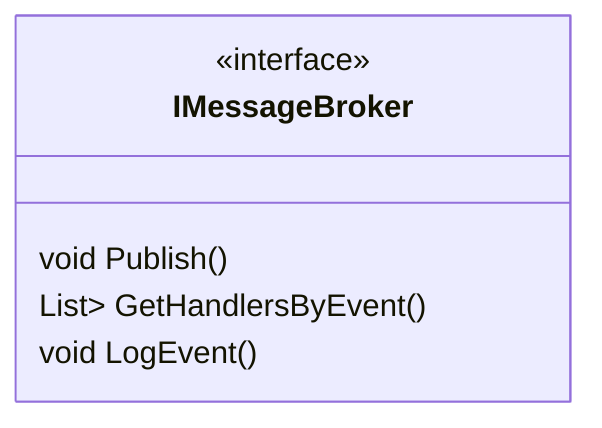
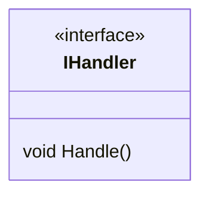
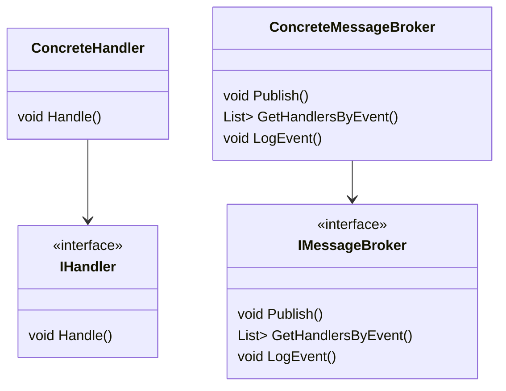

# EventSystem

This event system is an implementation of a Domain Event System using Domain-Driven Design (DDD) and Clean Architecture.

## Application Layer

The application layer contains the following interfaces and classes:

## IMessageBroker Interface

This interface defines how a MessageBroker that will deal with domain events must act.

    Publish(): Sends the domain event to all the registered handlers.
    GetHandlersByEvent(): Retrieves all the handlers that are subscribed to the domain event.
    LogEvent(): Logs the domain event on a database or another type of storage.

## IHandler Interface

This interface describes the base implementation of a handler.

        Handle(): Handles the domain event that is received from the MessageBroker.
        
## Concrete Handlers

All the Concrete Handlers will be placed in the application layer because usually each handler will have a repository for the subscriber entity and will also call the Handle method inside the entity on the domain layer.
Each subscriber will have its own handler class. So an event can be subscribed by one or more entities in the domain layer.

## Infrastructure Layer

The infrastructure layer is responsible for implementing the concrete MessageBroker.
Concrete MessageBroker

## The concrete MessageBroker implementation consists of the following steps:

    The Publish() method calls the GetHandlersByEvent() method.
    The GetHandlersByEvent() method retrieves all the handlers that are subscribed to the domain event using a file with the subscribers list that will be placed in the same infrastructure layer. Each event will have its own file, where the developer can add or remove a handler.
    The Publish() method sends the domain event to all the handlers and logs the event on a database or another type of storage.

## Relationships

Note that the TEvent type parameter is used to represent the domain event that the interfaces are dealing with. This parameter will be replaced by the actual type of the domain event when implementing the interfaces. Also, the ConcreteHandler and ConcreteMessageBroker classes are not interfaces but concrete implementations that will be placed in the application and infrastructure layers, respectively.

The Event System described in this scenario is an implementation of Domain Event System using DDD and Clean Architecture. The system has two main layers: Application and Infrastructure. The Application layer contains the IMessageBroker interface and the IHandler interface, while the Infrastructure layer is responsible for implementing the concrete MessageBroker.

## Advantages:

- Scalability: The Event System makes it easier to scale a system since it separates concerns and ensures that the code is modular. This allows developers to easily add new subscribers to the system without affecting existing code.

- Decoupling: The Event System ensures that different parts of the system are decoupled from each other, which means that changes made in one part of the system will not affect other parts of the system. This makes it easier to maintain and extend the system.

- Flexibility: The Event System allows developers to change the MessageBroker implementation if needed, which means that the system is not tied to a specific implementation. This makes it easier to adapt the system to changing requirements.

- Modularity: The Event System ensures that each subscriber has its own handler class, which means that the code is modular and easier to understand and maintain.

- Traceability: The Event System logs events on a database, which means that developers can easily trace events that have occurred in the system.

- Separation of concerns: The application layer is responsible for handling domain events, while the infrastructure layer is responsible for the actual implementation of the message broker. This separation allows for better organization and easier maintenance of the codebase.

- Testability: Because the application layer is separate from the infrastructure layer, it is easier to test the application layer in isolation from the infrastructure layer.

## Disadvantages

- Complexity: This system can be more complex than a simpler implementation of event handling. It may be difficult to understand for developers who are new to DDD or Clean Architecture.

- File-based implementation: The use of files to store the subscriber list for each event may not be the most efficient or scalable way to handle subscriptions. Additionally, modifying the list of subscribers requires changing the file, which may be cumbersome.
